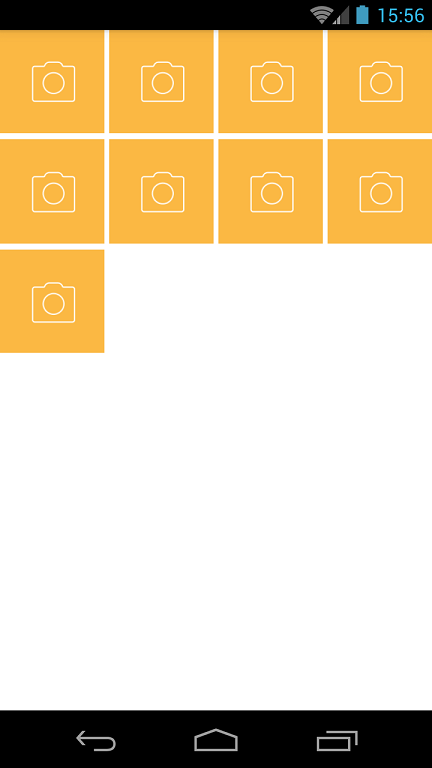

# NineGridView
九宫格布局，普通View实现，可像使用GridView一样设置Adapter，类似于微博的网格图片布局。



### gradle引入
```
    compile 'com.zhqchen:ninegridview:1.0.1'
```

### 配置项
```
    maxItems:最大item数量, 默认为9
    numColumns: 网格的列数，默认为3
    verticalSpacing: 垂直方向的网格间隔
    horizontalSpacing: 水平方向的网格间隔
```

### 使用
#### 1. 在布局中加入组件:
~~~xml
    <com.zhqchen.ninegrid.NineGrideView
            xmlns:app="http://schemas.android.com/apk/res-auto"
            android:id="@+id/ngv_test"
            android:layout_width="match_parent"
            android:layout_height="wrap_content"
            app:verticalSpacing="4dp"
            app:horizontalSpacing="4dp"/>
~~~

#### 2. 设置adapter:
~~~java
ngvTest.setAdapter(mAdapter);
~~~
here is the sample code
~~~java
public class MyGridAdapter extends NineGrideView.NineGridAdapter<Integer> {

        public MyGridAdapter(Context context, List<Integer> itemDatas) {
            super(context, itemDatas);
        }

        @Override
        protected View initViewHolder(View convertView) {
            if(convertView == null) {
                convertView = new ImageView(context);//自定义Layout
            }
            return convertView;
        }

        @Override
        protected void bindData(View convertView, int position) {
            ((ImageView)convertView).setImageResource(itemDatas.get(position));
        }

    }
~~~
#### 3. 在界面销毁时做必要的释放:
~~~java
    @Override
    protected void onDestroy() {
        ngvTest.recycle();
        super.onDestroy();
    }
~~~
### 说明
    使用者需继承NineGridAdapter，在自己实现的adapter中自己控制Item的布局，包括各种点击事件的监听均可自由处理。
### License

	Copyright 2016 Zhq Chen

	Licensed under the Apache License, Version 2.0 (the "License");	you may not use this file except in compliance with the License.
	You may obtain a copy of the License at

		http://www.apache.org/licenses/LICENSE-2.0

	Unless required by applicable law or agreed to in writing, software
	distributed under the License is distributed on an "AS IS" BASIS,
	WITHOUT WARRANTIES OR CONDITIONS OF ANY KIND, either express or implied.
	See the License for the specific language governing permissions and
	limitations under the License.

